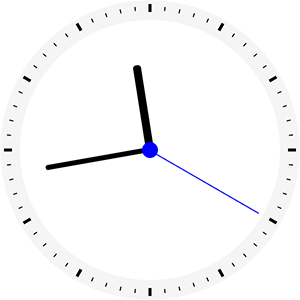
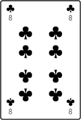
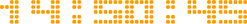
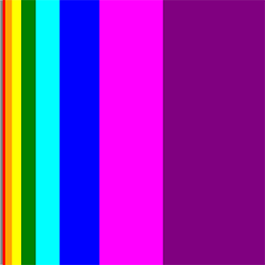
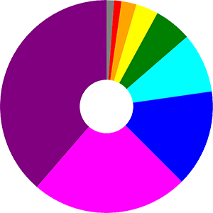
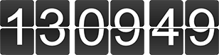

# Comentsys Community Controls

Comentsys Community Controls is a set of Universal Windows Platform Controls available for developing Windows 10 applications

## Dice

Dice control that can display values that resembles a single Dice or Die face

### Syntax

```xaml
<Page ...
     xmlns:comentsys="using:Comentsys.Community.Controls"/>

<comentsys:Dice Height="100" Width="100" Background="Red" Foreground="White" CornerRadius="10" Value="3"/>
```

### Output


### Properties

| Property | Type | Description |
| -- | -- | -- |
| Foreground | Brush | Gets or sets the foreground colour of a single dice |
| Background | Brush | Gets or sets the background colour of a single dice |
| Value | int | Gets or sets the value to display on a single dice between 0 and 6 |
| CorderRadius | CornerRadius | Gets or sets the Corner Radius of the control |

### Examples

**XAML**

```xaml
<comentsys:Dice Height="100" Width="100" Background="White" Foreground="Black" CornerRadius="5" Value="5"/>
```

**C#**

```csharp
Dice dice = new Dice()
{
    Height = 100,
    Width = 100,
    Background = new SolidColorBrush(Colors.White),
    Foreground = new SolidColorBrush(Colors.Black),
    CornerRadius = new CornerRadius(5),
    Value = 5
};
```

## Clock

Clock control that resembles an analogue clock

### Syntax

```xaml
<Page ...
     xmlns:comentsys="using:Comentsys.Community.Controls"/>

<comentsys:Clock Height="300" Width="300" RimBackground="WhiteSmoke" RimForeground="Black" SecondHandForeground="Blue"/>
```

### Output



### Properties

| Property | Type | Description |
| -- | -- | -- |
| Fill | Brush | Gets or sets the fill colour of the clock |
| RimBackground | Brush | Gets or sets the background colour of the rim of the clock |
| RimForeground | Brush | Gets or sets the foreground colour of the rim of the clock |
| SecondHandForeground | Brush | Gets or sets the foreground colour of the second hand of the clock |
| MinuteHandForeground | Brush | Gets or sets the foreground colour of the minute hand of the clock |
| HourHandForeground | Brush | Gets or sets the foreground colour of the hour hand of the clock |
| ShowSecondHand | bool | Gets or sets value to show or hide the second hand of the clock |
| ShowMinuteHand | bool | Gets or sets value to show or hide the minute hand of the clock |
| ShowHourHand | bool | Gets or sets value to show or hide the hour hand of the clock |
| IsRealTime | bool | Gets or sets if the clock should be real time |
| Value | DateTime | Gets or sets the value to display on the clock if not real time |

### Examples

**XAML**

```xaml
<comentsys:Clock Height="300" Width="300" RimBackground="Black" RimForeground="White"  HourHandForeground="Red" MinuteHandForeground="Green" SecondHandForeground="Blue"/>
```

**C#**

```csharp
Clock clock = new Clock()
{
    Height = 300,
    Width = 300,
    RimBackground = new SolidColorBrush(Colors.Black),
    RimForeground = new SolidColorBrush(Colors.White),
    HourHandForeground = new SolidColorBrush(Colors.Red),
    MinuteHandForeground = new SolidColorBrush(Colors.Green),
    SecondHandForeground = new SolidColorBrush(Colors.Blue)
};
```

## Dial

Dial control that can be used to set a value between a minimum and maximum value

### Syntax

```xaml
<Page ...
     xmlns:comentsys="using:Comentsys.Community.Controls"/>

<comentsys:Dial Height="200" Width="200" DialForeground="WhiteSmoke" DialBackground="Teal"/>
```

### Output


### Properties

| Property | Type | Description |
| -- | -- | -- |
| DialBackground | Brush | Gets or sets the background colour of the dial |
| DialForeground | Brush | Gets or sets the foreground colour of the dial |
| Value | double | Gets the value selected by the dial |

### Events

| Events | Description |
| -- | -- |
| ValueChanged | Fires whenever the dial value is changed |

### Examples

**XAML**

```xaml
<comentsys:Dial Height="200" Width="200" DialForeground="Blue" DialBackground="WhiteSmoke"/>
```

**C#**

```csharp
Dial dial = new Dial()
{
    Height = 200,
    Width = 200,
    DialBackground = new SolidColorBrush(Colors.WhiteSmoke),
    DialForeground= new SolidColorBrush(Colors.Blue)
};
```

## Segment

Segment control that can be used to display numbers like a seven-segment display plus colon character

### Syntax

```xaml
<Page ...
     xmlns:comentsys="using:Comentsys.Community.Controls"/>

<comentsys:Segment Height="100" Foreground="Red" Source="Time"/>
```

### Output


### Types

**Sources**

| Value | Description |
| -- | -- |
| Value | Show the provided Value |
| Time | Show the current Time |
| Date | Show the current Date |
| TimeDate | Show the current Time & Date |

### Properties

| Property | Type | Description |
| -- | -- | -- |
| Foreground | Brush | Gets or sets the foreground colour of the segment |
| Source | Sources | Gets or sets the source of the segment of Value, Time, Date or TimeDate |
| Value | string | Gets the value shown by the segment |

### Examples

**XAML**

```xaml
<comentsys:Segment Height="100" Foreground="PaleVioletRed" Source="TimeDate"/>
```

**C#**

```csharp
Segment segment = new Segment()
{
    Height = 100,
    Foreground = new SolidColorBrush(Colors.PaleVioletRed),
    Source = Segment.Sources.TimeDate
};
```

## Card

Card control can be used to display various Playing Cards for Card-based games like Blackjack, Poker and more

### Syntax

```xaml
<Page ...
     xmlns:comentsys="using:Comentsys.Community.Controls"/>

<comentsys:Card Width="120" Value="8"/>
```

### Output



### Properties

| Property | Type | Description |
| -- | -- | -- |
| Fill | Brush | Gets or sets the fill colour of the card |
| Value | int | Gets the value shown by the card between 0 and 52 where 0 is a blank card. 1-13 is Ace of Clubs to King of Clubs, 14-26 is Ace of Diamonds to King of Diamonds, 27-39 is Ace of Hearts to King of Hearts and 40-52 is Ace of Spaces to King of Spaces |

### Examples

**XAML**

```xaml
<comentsys:Card Width="120" Value="20"/>
```

**C#**

```csharp
Card card = new Card()
{
    Width = 120,
    Value = 20
};
```

## Direct

Direct control can be used as an on-screen Directional Pad for XAML-based games

### Syntax

```xaml
<Page ...
     xmlns:comentsys="using:Comentsys.Community.Controls"/>

<comentsys:Direct Width="150" Foreground="Black"/>
```

### Output


### Types

**Direction**

| Value | Description |
| -- | -- |
| None | 0 - No Direction |
| Up | 1 - Up Direction |
| Down | 2 - Down Direction |
| Left | 3 - Left Direction |
| Right | 4 - Right Direction |

### Properties

| Property | Type | Description |
| -- | -- | -- |
| Foreground | Brush | Gets or sets the foreground colour of the Direct control |
| Value | Direction | Gets the Direction Value of the control |

### Events

| Events | Description |
| -- | -- |
| ValueChanged | Fires whenever the Value is changed |

### Examples

**XAML**

```xaml
<comentsys:Direct Width="150" Foreground="Yellow"/>
```

**C#**

```csharp
Direct direct = new Direct()
{
    Width = 150,
    Foreground = new SolidColorBrush(Colors.Yellow),
};
```

## Domino

Domino control can be used to display various Domino tile values

### Syntax

```xaml
<Page ...
     xmlns:comentsys="using:Comentsys.Community.Controls"/>

<comentsys:Domino Width="150" Value="2"/>
```

### Output


### Properties

| Property | Type | Description |
| -- | -- | -- |
| Foreground | Brush | Gets or sets the foreground colour of the domino |
| Fill | Brush | Gets or sets the fill colour of the domino |
| Value | int | Gets the value shown by the domino between 0 and 28 where 0 is a blank domino. Dominos that can be displayed are 0 0,0 1,1 1,0 2,1 2,2 2,0 3,1 3,2 3,3 3,0 4,1 4,2 4,3 4,4 4,0 5,1 5,2 5,3 5,4 5,5 5,0 6,1 6,2 6,3 6,4 6,5 6,6 6 |

### Examples

**XAML**

```xaml
<comentsys:Domino Width="120" Value="10"/>
```

**C#**

```csharp
Domino domino = new Domino()
{
    Width = 120,
    Value = 10
};
```

## Matrix

Matrix control that can be used to display numbers like a dot-matrix display plus colon, dash and forward-slash character

### Syntax

```xaml
<Page ...
     xmlns:comentsys="using:Comentsys.Community.Controls"/>

<comentsys:Matrix Height="250" Foreground="Orange" Source="Time"/>
```

### Output



### Types

**Sources**

| Value | Description |
| -- | -- |
| Value | Show the provided Value |
| Time | Show the current Time |
| Date | Show the current Date |
| TimeDate | Show the current Time & Date |

### Properties

| Property | Type | Description |
| -- | -- | -- |
| Foreground | Brush | Gets or sets the foreground colour of the matrix |
| Source | Sources | Gets or sets the source of the matrix of Value, Time, Date or TimeDate |
| Value | string | Gets the value shown by the matrix |

### Examples

**XAML**

```xaml
<comentsys:Matrix Width="200" Foreground="Green" Source="TimeDate"/>
```

**C#**

```csharp
Matrix matrix = new Matrix()
{
    Width = 200,
    Foreground = new SolidColorBrush(Colors.Green),
    Source = Matrix.Sources.TimeDate
};
```

## Stack

Stack control is a stack-based chart that can be used to display a set of values in the form of horizontal or vertical bars

### Syntax

```xaml
<Page ...
     xmlns:comentsys="using:Comentsys.Community.Controls"/>

<comentsys:Stack Height="300" Width="300"/>
```

### Output



### Types

**ChartItem**

| Property | Type | Description |
| -- | -- | -- |
| Brush | Brush | Gets or sets the foreground colour to use for the data item |
| Value | double | Gets or sets the percentage value of the data item |

### Properties

| Property | Type | Description |
| -- | -- | -- |
| Orientation | Orientation | Gets or sets the orientation of the stack chart |
| Values | List&lt;ChartItem&gt; | Gets or sets list of values shown by the stack chart |

### Examples

**XAML**

```xaml
<comentsys:Stack Width="200" Height="200"/>
```

**C#**

```csharp
Stack stack = new Stack()
{
    Width = 200,
    Height = 200,
    Values = new List<ChartItem>()
    {
        new ChartItem()
        {
            Brush = new SolidColorBrush(Colors.Red),
            Value = 20
        },
        new ChartItem()
        {
            Brush = new SolidColorBrush(Colors.Green),
            Value = 40
        },
        new ChartItem()
        {
            Brush = new SolidColorBrush(Colors.Blue),
            Value = 60
        }
    }
};
```

## Donut

Donut control is a donut-based pie-like chart that can be used to display a set of values in the form of arc-like segments

### Syntax

```xaml
<Page ...
     xmlns:comentsys="using:Comentsys.Community.Controls"/>

<comentsys:Donut Height="300" Width="300"/>
```

### Output



### Types

**ChartItem**

| Property | Type | Description |
| -- | -- | -- |
| Brush | Brush | Gets or sets the foreground colour to use for the data item |
| Value | double | Gets or sets the percentage value of the data item |

### Properties

| Property | Type | Description |
| -- | -- | -- |
| Hole | double | Gets or sets the size of the hole of the donut chart between 1 and 100 |
| Values | List&lt;ChartItem&gt; | Gets or sets list of values shown by the stack chart |

### Examples

**XAML**

```xaml
<comentsys:Donut Width="200" Height="200"/>
```

**C#**

```csharp
Donut donut = new Donut()
{
    Width = 200,
    Height = 200,
    Values = new List<ChartItem>()
    {
        new ChartItem()
        {
            Brush = new SolidColorBrush(Colors.Red),
            Value = 20
        },
        new ChartItem()
        {
            Brush = new SolidColorBrush(Colors.Green),
            Value = 40
        },
        new ChartItem()
        {
            Brush = new SolidColorBrush(Colors.Blue),
            Value = 60
        }
    }
};
```

## Direct

Direct control can be used as an on-screen Directional Pad for XAML-based games

### Syntax

```xaml
<Page ...
     xmlns:comentsys="using:Comentsys.Community.Controls"/>

<comentsys:Stick Radius="100" Width="250" Foreground="Black" Fill="WhiteSmoke"/>
```

### Output


### Properties

| Property | Type | Description |
| -- | -- | -- |
| Foreground | Brush | Gets or sets the foreground colour of the Stick control |
| Fill | Brush | Gets or sets the fill colour of the Stick control |
| Radius | int | Gets or sets the radius of the Stick control |
| Sensitivity | double | Gets or sets the sensitivity of the Stick control |
| Angle | double | Gets the rotation angle of the Stick control around the centre |
| Ratio | double | Gets the movement ratio of the Stick control from the centre to the outside edge |

### Events

| Events | Parameters | Description |
| -- | -- | -- |
| ValueChanged | double angle, double ratio | Fires whenever the Value is changed with the current angle and ratio values |

### Examples

**XAML**

```xaml
<comentsys:Stick Radius="100" Width="250" Foreground="Blue" Fill="Yellow"/>
```

**C#**

```csharp
Stick stick = new Stick()
{
    Radius = 100,
    Width = 250,
    Foreground = new SolidColorBrush(Colors.Blue),
    Fill = new SolidColorBrush(Colors.Yellow),
};
```

## Split

Split control that can be used to display numbers like a flip clock or split-flip display including animation for the flipping when values are changed

### Syntax

```xaml
<Page ...
     xmlns:comentsys="using:Comentsys.Community.Controls"/>

<comentsys:Split Height="250" Foreground="White" Source="Time"/>
```

### Output



### Types

**Sources**

| Value | Description |
| -- | -- |
| Value | Show the provided Value |
| Time | Show the current Time |
| Date | Show the current Date |
| TimeDate | Show the current Time & Date |

### Properties

| Property | Type | Description |
| -- | -- | -- |
| Foreground | Brush | Gets or sets the foreground colour of the split clock |
| Source | Sources | Gets or sets the source of the split clock of Value, Time, Date or TimeDate |
| Value | string | Gets the value shown by the split clock |
| Orientation | Orientation | Gets the orientation of the split clock |

### Examples

**XAML**

```xaml
<comentsys:Split Width="500" Foreground="Cyan" Source="TimeDate"/>
```

**C#**

```csharp
Split split = new Split()
{
    Width = 500,
    Foreground = new SolidColorBrush(Colors.Cyan),
    Source = Matrix.Sources.TimeDate
};
```